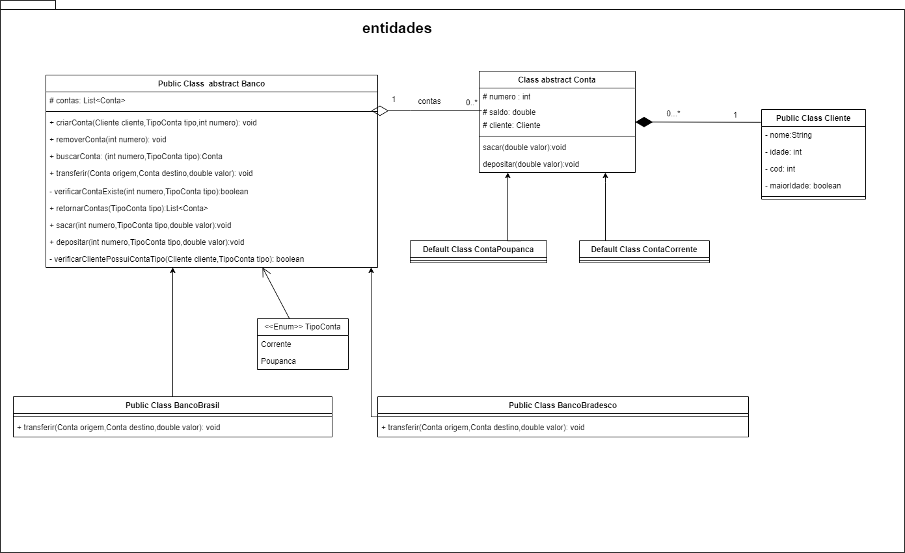

# Projeto de Banco  em Java

Olá pessoal,
Estou compartilhando aqui um projeto prático que desenvolvi para reforçar meus conhecimentos em Programação Orientada a Objetos (POO) em Java. Este projeto consiste na implementação de um banco digital.

## Descrição

Neste projeto, utilizei os conceitos de POO e Java para criar um banco digital. Explorei o contexto bancário para aplicar os pilares da orientação a objetos e desenvolver minha capacidade de abstração.

## Diagrama UML

